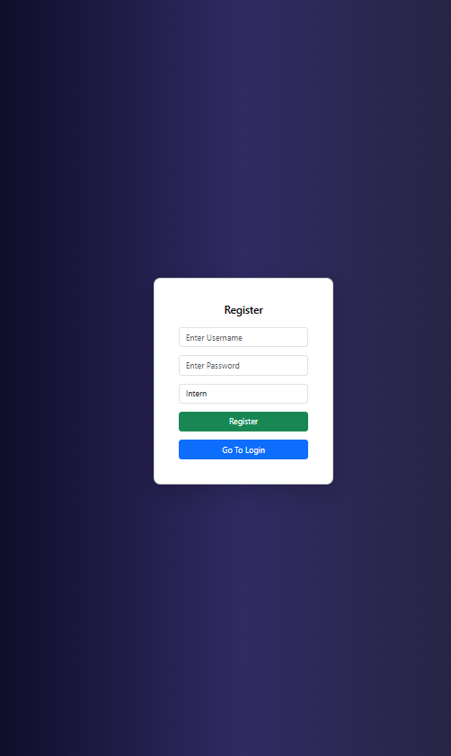
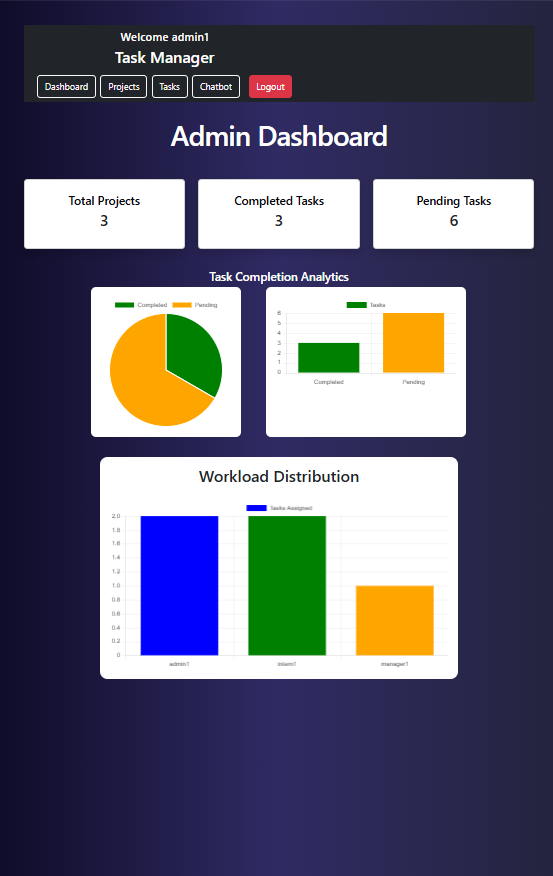
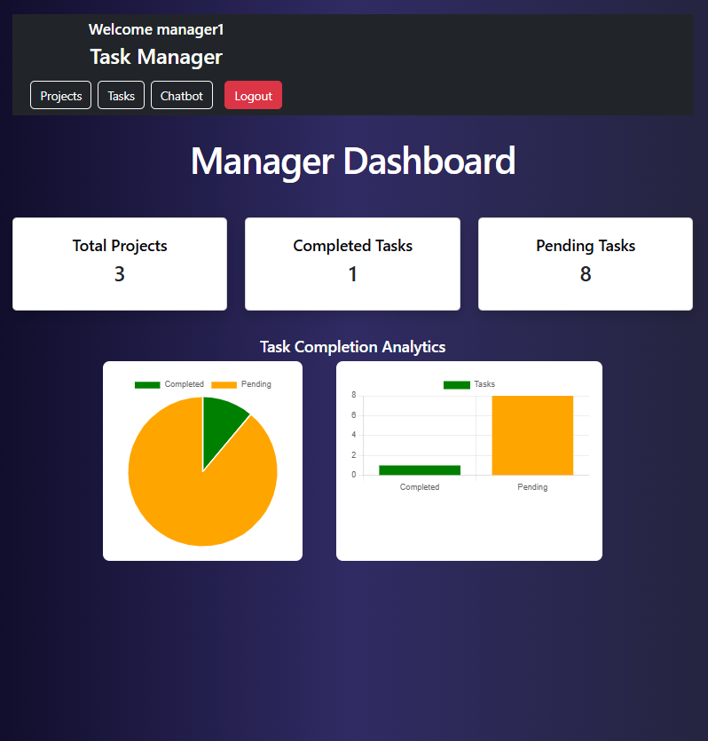
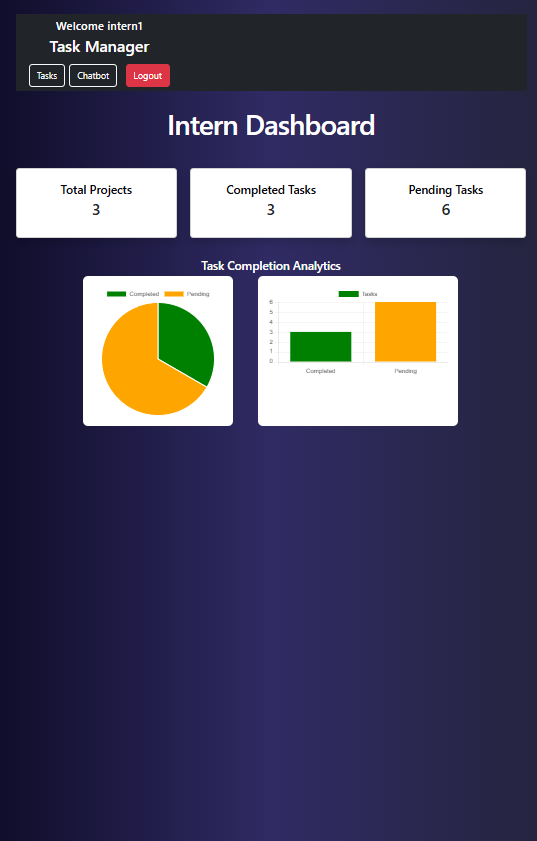
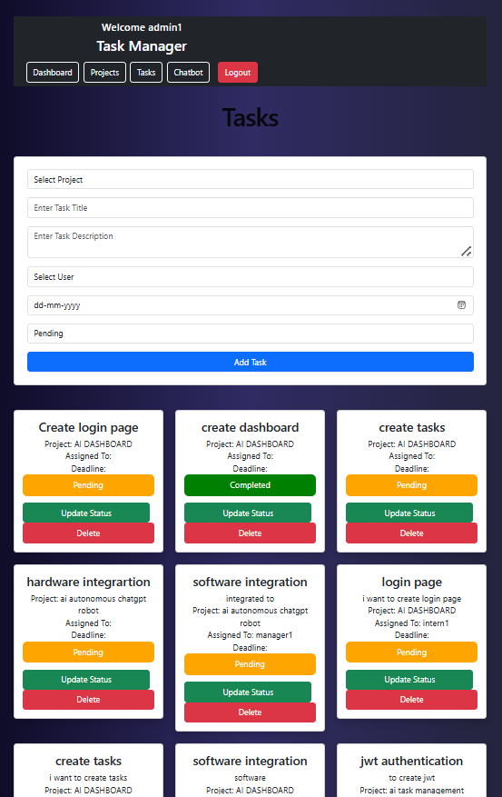
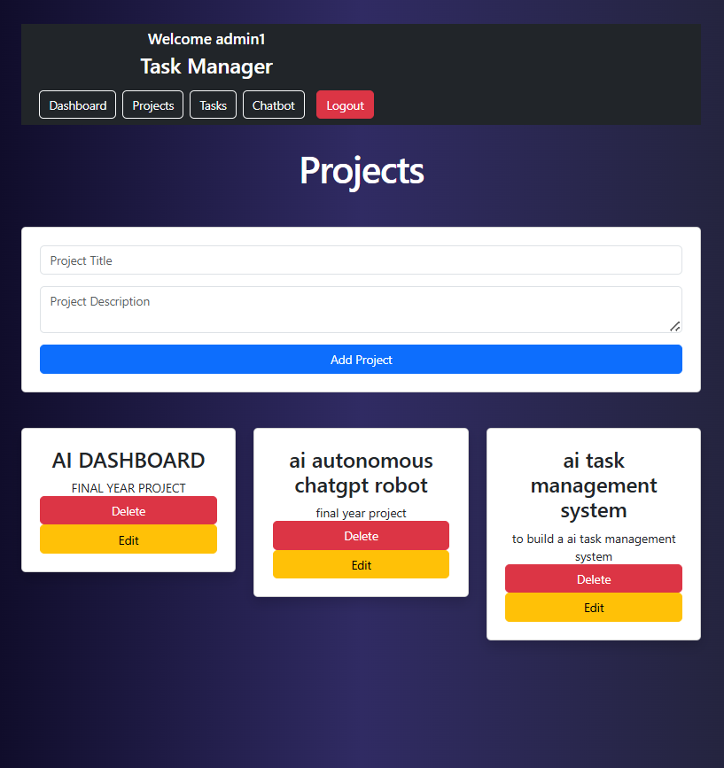
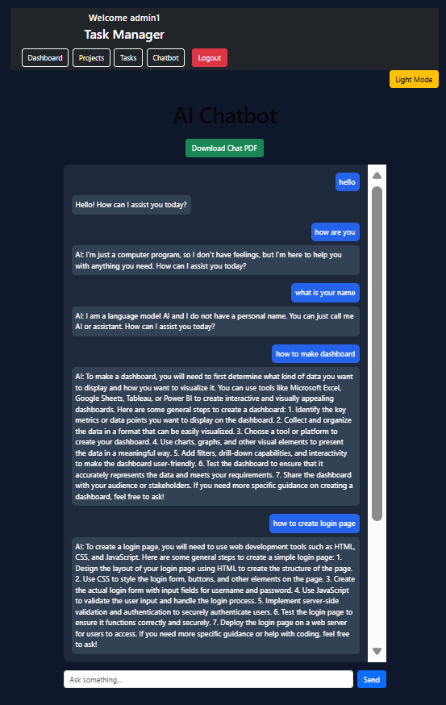

````md
# AI Task Management System

A full-stack AI-powered task management platform built using Django REST Framework and React. The system supports role-based authentication, real-time task updates, analytics dashboards, and an AI chatbot with chat history, streaming responses, and PDF export.

---

# 🚀 Features

## 🔐 Authentication & Roles

- JWT Authentication using DRF Simple JWT
- Role-based access control
- Separate dashboards for:
  - Admin
  - Manager
  - Intern
- Secure login system

---

## 📁 Project & Task Management

### Project Features
- Create projects
- Update projects
- Delete projects
- View all projects

### Task Features
- Create tasks
- Update task status
- Delete tasks
- Assign tasks to users
- Deadline management
- Task descriptions
- Task status tracking

### Real-Time Updates
- WebSocket integration using Django Channels
- Real-time task status updates without refreshing

---

# 📊 Dashboard & Analytics

- Total projects card
- Completed tasks card
- Pending tasks card
- Task completion charts
- Workload distribution chart
- Analytics using Chart.js

---

# 🤖 AI Chatbot Integration

## Chatbot Features

- Dedicated chatbot page
- Chat bubble UI
- AI-generated responses
- Streaming typing effect
- Context-aware replies
- Remembers last 5 messages
- Save chat history per user
- Download chat history as PDF
- Dark/Light mode toggle

## AI Integration

- OpenRouter API integration
- GPT-based chatbot responses

---

# 🛠️ Tech Stack

## Frontend

- React
- React Router DOM
- Axios
- Bootstrap
- Chart.js
- React ChartJS 2

## Backend

- Django
- Django REST Framework
- Django Channels
- DRF Simple JWT
- WebSockets
- ReportLab

## Database

- SQLite (Development)
- PostgreSQL Ready

---

# 📂 Project Structure

```bash
ai-task-management-system/
│
├── backend/
│   ├── accounts/
│   ├── projects/
│   ├── chatbot/
│   ├── config/
│   └── manage.py
│
├── frontend/
│   ├── src/
│   │   ├── pages/
│   │   ├── components/
│   │   └── routes/
│
└── README.md


# ⚙️ Backend Setup

## 1. Clone Repository

git clone https://github.com/shifaz935/ai-task-management-system.git
```

## 2. Open Backend Folder


cd ai-task-management-system/backend


## 3. Create Virtual Environment


python -m venv venv


## 4. Activate Virtual Environment

### Windows


venv\Scripts\activate


### Linux/Mac


source venv/bin/activate


## 5. Install Dependencies


pip install -r requirements.txt


## 6. Run Migrations


python manage.py makemigrations
python manage.py migrate


## 7. Start Backend Server

### Django Server


python manage.py runserver


### OR Daphne Server (WebSockets)


daphne config.asgi:application


---

# 💻 Frontend Setup

## 1. Open Frontend Folder


cd frontend


## 2. Install Dependencies


npm install


## 3. Start React Server


npm run dev

---

# 🔑 Environment Variables

Add your API keys inside:


backend/config/settings.py


Example:

```python
OPENROUTER_API_KEY = "YOUR_API_KEY"
```

---

# 📸 Example Screenshots

## Login Page


## Register Page



## Admin Dashboard



## Manager Dashboard



## Intern Dashboard



## Task Management



## Project Dashboard



## AI Chatbot




# 🔄 Real-Time Features

* WebSocket-based task updates
* Streaming chatbot responses
* Instant UI updates


# 🔒 Security Features

* JWT authentication
* Role-based access control
* Protected routes
* Secure APIs


# ✨ Extra Features

* PDF export
* Streaming AI responses
* Context-aware chatbot
* Dark/Light mode
* Real-time updates


# 👨‍💻 Author

Shifas

BTech Artificial Intelligence & Data Science


# 📜 License

This project is developed for educational and internship evaluation purposes.

